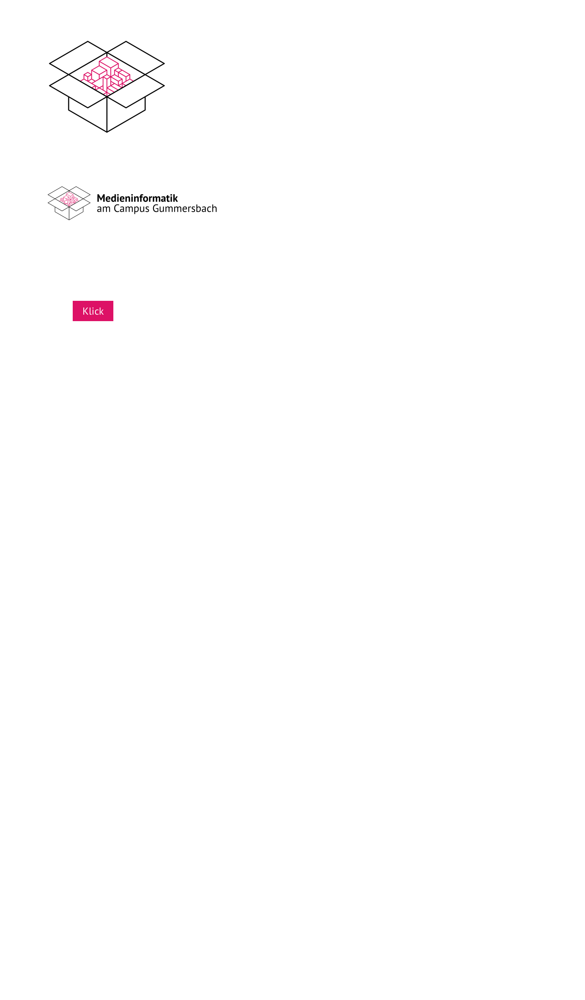
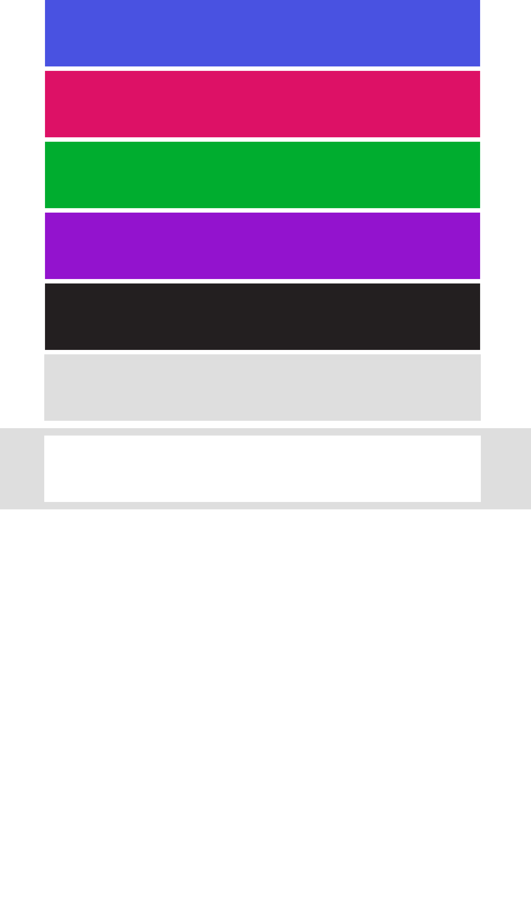
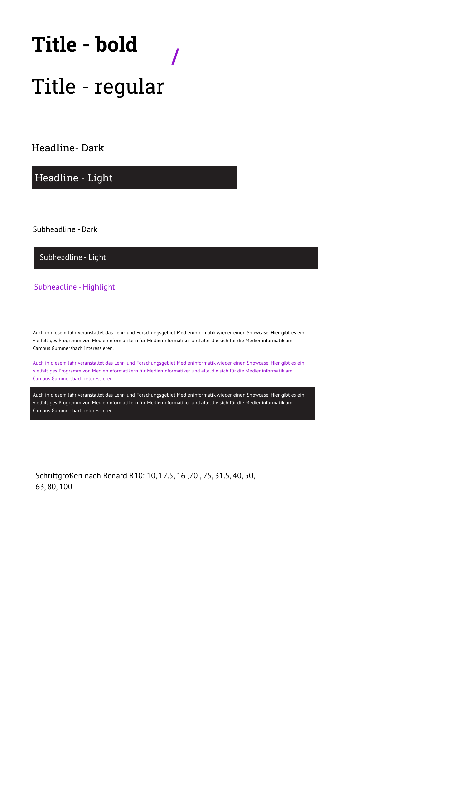

# Artboards

This is an autogenerated file showing all the artboards. Do not edit it directly.

## Abstände

## Atoms

## Base

## Colors

## Horizontal Stack Symbol with Space

## Molecules

## Organisms

## Playground Copy 10

## Playground Copy 2

## Playground Copy 3

## Playground Copy 4

## Playground Copy 5

## Playground Copy 6

## Playground Copy 7

## Playground Copy 8

## Playground Copy 9

## Playground Copy

## Playground

## Typo

## atoms

## base

## contenttypes

## icons

## molecules

## organisms

## temp

